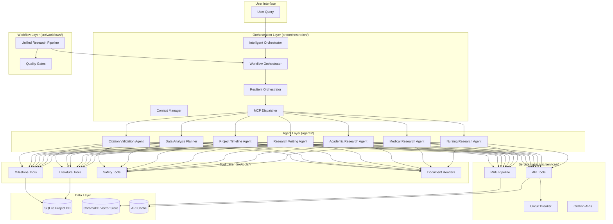

# AGENTS.md
# Nursing Research Project Assistant — Agent Operating Manual

This file defines the rules, responsibilities, architecture, workflows, and quality standards for all AI coding agents contributing to the nurseRN project.  
Agents MUST follow this document when modifying code, adding features, writing tests, or performing maintenance.

---

# 1. Purpose

The nurseRN system is a multi-agent AI platform designed to support nursing residents through their healthcare improvement projects.  
This AGENTS.md file ensures:

- Consistent development practices  
- Reliable orchestration behavior  
- High-quality research output  
- Safe tool usage  
- Automated testing and validation  
- Predictable agent behavior  

Human developers are NOT required to write tests or maintain them — this responsibility is delegated to AI agents.

---

# 2. Project Architecture

## 2.1 High-Level Overview
The system uses a layered architecture:

- **Agent Layer** — Domain-specialized AI agents  
- **Orchestration Layer** — Planning, execution, resilience  
- **Workflow Layer** — Multi-phase research pipelines  
- **Service Layer** — API tools, circuit breakers, RAG  
- **Tool Layer** — Document readers, literature tools, safety tools  
- **Data Layer** — SQLite DBs, vector stores, caches  

## 2.2 Architecture Diagram

