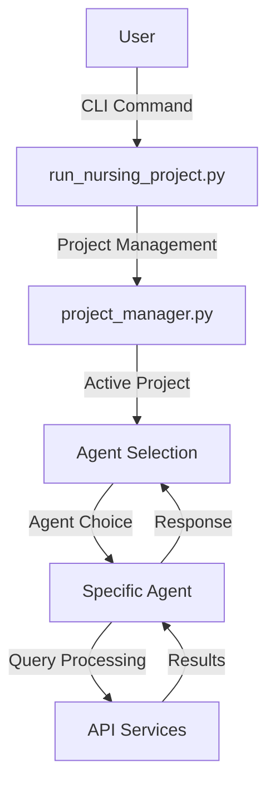
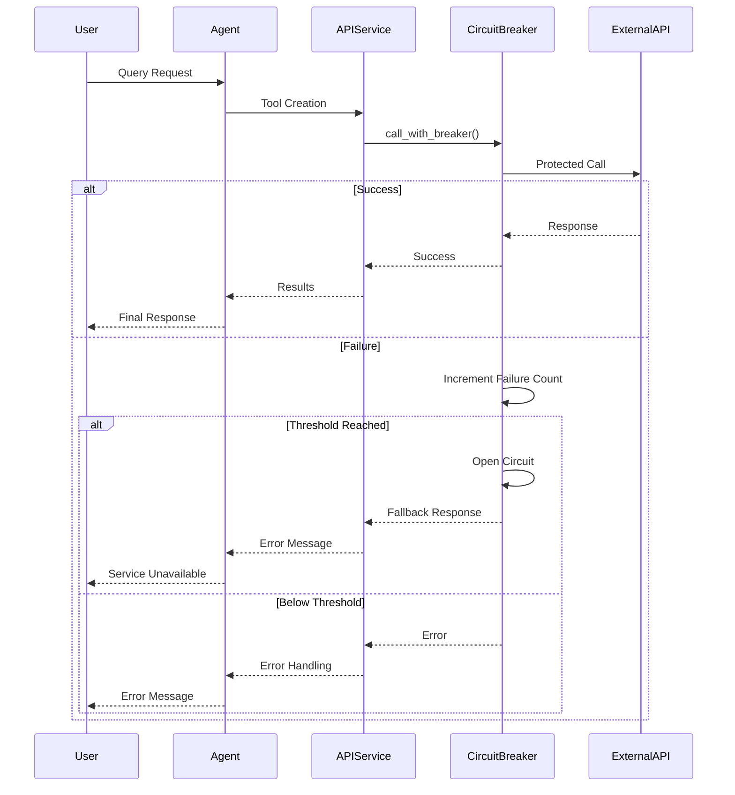
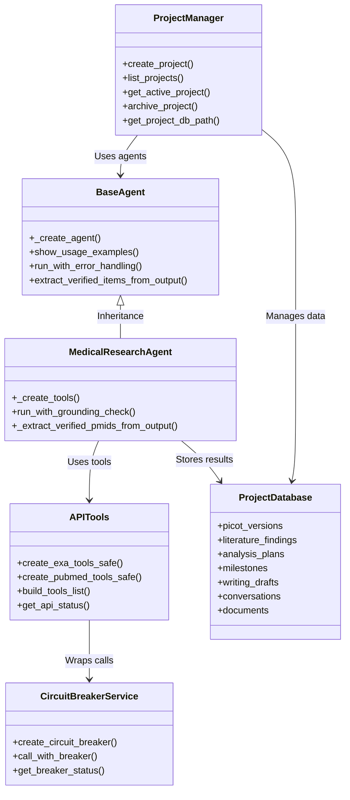

# 🏗️ Nursing Research Project Assistant - Comprehensive Architectural Design

## 📋 Executive Summary

The Nursing Research Project Assistant is a **project-centric multi-agent AI system** designed to support nursing residents through their healthcare improvement projects (November 2025 - June 2026). This document provides a complete architectural analysis of the system, covering all layers, components, and their interactions.

---

## 🎯 System Overview

### Core Purpose
- **Support nursing residents** in developing healthcare improvement projects
- **Facilitate PICOT question development**, literature search, data analysis, and project management
- **Ensure clinical safety** through rigorous validation and audit logging
- **Provide resilience** through circuit breaker patterns and error handling

### Timeline
- **Project Duration**: November 2025 - June 2026
- **Current Status**: Production-ready (as of November 2025)

---

## 🗺️ Architectural Layers

The system follows a **layered architecture** with clear separation of concerns:

### 1. Presentation Layer
- **CLI Interface**: `run_nursing_project.py`
- **User Interaction**: Project management menu, agent selection, chat interface
- **Disclaimer System**: Clinical liability protection

### 2. Application Layer
- **Project Management**: `project_manager.py`
- **Agent Orchestration**: 6 specialized AI agents
- **Configuration Management**: `agent_config.py`

### 3. Service Layer
- **API Services**: `src/services/api_tools.py`
- **Resilience Services**: `src/services/circuit_breaker.py`
- **Audit Logging**: Comprehensive action tracking

### 4. Data Layer
- **Project Databases**: SQLite databases per project
- **Agent Databases**: Individual SQLite databases for each agent
- **Schema Management**: 7 core tables with relationships

### 5. Hallucination Prevention Layer (Phase 2)
- **Deterministic Mode**: `temperature=0` enforced for all agents
- **Audit Hooks**: `_audit_pre_hook` and `_audit_post_hook` in `BaseAgent`
- **Validation Logic**: `_validate_run_output` ensures grounding
- **Audit Logging**: Immutable JSONL trails in `.claude/agent_audit_logs/`

### 6. Infrastructure Layer
- **Agno Framework**: Vendored in `libs/agno/`
- **Environment Configuration**: `.env` file management
- **Error Handling**: Comprehensive exception management

---

## 🧩 Core Components Analysis

### 1. Project Management System

**Component**: `project_manager.py`
**Responsibilities**:
- Project creation, switching, archival
- Database initialization with schema
- Milestone tracking (Nov 2025 - June 2026)
- Active project state management

**Key Features**:
- **Project Directory Structure**: `data/projects/{project_name}/`
- **Database Schema**: 7 core tables (PICOT, Literature, Analysis, Milestones, etc.)
- **Default Milestones**: 6 predefined milestones with due dates
- **Archival System**: Move completed projects to `data/archives/`

### 2. Agent Architecture

**Base Class**: `agents/base_agent.py`
**Inheritance Pattern**: All 6 agents inherit from `BaseAgent`

**Agent Types**:
1. **Nursing Research Agent**: PICOT development, healthcare standards
2. **Medical Research Agent**: PubMed searches, clinical studies
3. **Academic Research Agent**: ArXiv searches, research methodologies
4. **Research Writing Agent**: Academic writing, literature synthesis
5. **Project Timeline Agent**: Milestone tracking, deadline management
6. **Data Analysis Planner**: Statistical analysis, sample size calculations

**Key Features**:
- **Audit Logging**: Every action tracked in immutable JSONL files
- **Error Handling**: Comprehensive try-catch patterns
- **Configuration**: Centralized via `agent_config.py`
- **Database**: Individual SQLite databases per agent

### 3. API Services Layer

**Component**: `src/services/api_tools.py`
**Responsibilities**:
- Safe tool creation with fallback patterns
- Circuit breaker protection for all external APIs
- HTTP response caching (24hr TTL)
- API status monitoring

**Supported APIs**:
- **Exa API**: Web search and article discovery
- **SerpAPI**: Google search capabilities
- **PubMed**: Biomedical literature database
- **ArXiv**: Academic paper repository
- **ClinicalTrials.gov**: Clinical trial information
- **medRxiv/bioRxiv**: Preprint servers
- **Semantic Scholar**: Academic search engine
- **CORE**: Open access research papers
- **DOAJ**: Directory of Open Access Journals
- **OpenFDA**: Device recalls and drug events

### 4. Circuit Breaker System

**Component**: `src/services/circuit_breaker.py`
**Pattern**: Circuit Breaker with 3 states (CLOSED, OPEN, HALF_OPEN)

**Configuration**:
- **Failure Threshold**: 5 failures
- **Timeout**: 60 seconds
- **Logging**: Comprehensive event tracking

**Key Features**:
- **API Protection**: Prevents cascade failures
- **Graceful Degradation**: Fallback responses when APIs unavailable
- **Recovery Mechanism**: Automatic retry after timeout
- **Status Monitoring**: Real-time breaker state tracking

### 5. Data Architecture

**Database Structure**:
- **Project Databases**: `data/projects/{project_name}/project.db`
- **Agent Databases**: `tmp/{agent_name}_agent.db`
- **Schema**: 7 core tables with foreign key relationships

**Core Tables**:
1. **picot_versions**: PICOT question development and tracking
2. **literature_findings**: Research articles and sources
3. **analysis_plans**: Statistical analysis and data collection
4. **milestones**: Project timeline and deliverables
5. **writing_drafts**: Academic writing and content
6. **conversations**: Agent interactions and history
7. **documents**: File metadata and organization

---

## 🔄 Data Flow Architecture

### 1. User Interaction Flow



### 2. Data Persistence Flow

```mermaid
graph TD
    A[Agent Interaction] -->|Query| B[Agent Database]
    A -->|Results| C[Project Database]
    B -->|Audit Logs| D[.claude/agent_audit_logs/]
    C -->|Project Data| E[data/projects/{project}/]
    D -->|Validation| F[Grounding Checks]
    F -->|Verified| A
    F -->|Unverified| G[Refusal Response]
```

### 3. API Call Flow with Circuit Breaker



---

## 🔐 Security Architecture

### 1. Clinical Safety Measures

- **Disclaimer System**: Mandatory acknowledgment before use
- **Audit Logging**: Immutable JSONL logs for all actions
- **Grounding Validation**: `_validate_run_output` checks against tool data
- **Temperature Control**: `temperature=0` enforced for factual accuracy

### 2. Data Protection

- **Environment Variables**: API keys in `.env` (not committed)
- **Database Isolation**: Separate databases per project/agent
- **Error Handling**: Graceful degradation patterns
- **Input Validation**: Query length and format checking

### 3. Resilience Patterns

- **Circuit Breakers**: Prevent API cascade failures
- **Retry Logic**: Exponential backoff for transient failures
- **Fallback Responses**: Graceful handling of API unavailability
- **Caching**: 24-hour TTL for API responses

---

## 📊 System Components Relationship Diagram



---

## 🎯 Key Architectural Decisions

### 1. Project-Centric Design
- **Rationale**: Each nursing project has unique requirements and timeline
- **Implementation**: Separate database per project with standardized schema
- **Benefits**: Data isolation, easy archival, project-specific tracking

### 2. Multi-Agent Architecture
- **Rationale**: Different research tasks require specialized expertise
- **Implementation**: 6 distinct agents with clear responsibilities
- **Benefits**: Task specialization, focused functionality, easier maintenance

### 3. Circuit Breaker Pattern
- **Rationale**: External APIs can fail, causing cascade failures
- **Implementation**: Pybreaker-based circuit breakers for all APIs
- **Benefits**: System resilience, graceful degradation, automatic recovery

### 4. Grounding Validation System
- **Rationale**: Prevent AI hallucinations in clinical context
- **Implementation**: PMID verification against tool results
- **Benefits**: Clinical safety, factual accuracy, liability protection

### 5. Audit Logging System
- **Rationale**: Comprehensive tracking for clinical accountability
- **Implementation**: Immutable JSONL logs for all agent actions
- **Benefits**: Traceability, debugging, compliance documentation

---

## 🔧 Technical Stack

### Core Technologies
- **Language**: Python 3.8+
- **Framework**: Agno multi-agent framework (vendored)
- **Database**: SQLite with WAL mode
- **APIs**: OpenAI GPT-4o, PubMed, ArXiv, multiple research databases
- **Resilience**: Pybreaker circuit breakers, requests-cache

### Development Tools
- **Environment**: Virtual environment with `.venv`
- **Configuration**: `.env` file management
- **Testing**: Pytest with comprehensive test suite
- **Formatting**: Ruff for code quality

---

## 📈 Performance Characteristics

### System Scalability
- **Project Scalability**: Unlimited projects with individual databases
- **Agent Scalability**: Easy to add new specialized agents
- **API Scalability**: Circuit breakers prevent overload

### Response Times
- **Typical Query**: 2-5 seconds (depending on API calls)
- **Circuit Breaker Overhead**: <1ms per call
- **Database Operations**: <10ms for most queries

### Cost Estimates
- **Monthly Budget**: $10-20 for moderate usage
- **Per Query Cost**: $0.02-$0.04 depending on agent
- **Cost Control**: Circuit breakers prevent runaway API costs

---

## 🛡️ Failure Modes and Recovery

### Common Failure Scenarios
1. **API Unavailability**: Circuit breaker opens, fallback responses provided
2. **Database Corruption**: Schema validation on startup, backup recommendations
3. **Agent Hallucination**: Grounding validation detects and refuses output
4. **User Input Errors**: Comprehensive input validation and error messages

### Recovery Mechanisms
- **Automatic Recovery**: Circuit breakers reset after timeout
- **Manual Recovery**: Admin commands to reset breakers
- **Data Recovery**: Database backups recommended in documentation
- **Error Reporting**: Comprehensive logging and user notifications

---

## 🎓 Design Patterns Used

### 1. Circuit Breaker Pattern
- **Purpose**: Prevent cascade failures from external APIs
- **Implementation**: Pybreaker-based circuit breakers with logging

### 2. Factory Pattern
- **Purpose**: Safe tool creation with fallback
- **Implementation**: `create_*_tools_safe()` functions in API services

### 3. Strategy Pattern
- **Purpose**: Different search strategies per agent
- **Implementation**: Agent-specific tool configurations

### 4. Observer Pattern
- **Purpose**: Circuit breaker state monitoring
- **Implementation**: LoggingListener for state changes

### 5. Repository Pattern
- **Purpose**: Database access abstraction
- **Implementation**: ProjectManager as repository facade

---

## 📝 Configuration Management

### Environment Variables
- **Required**: `OPENAI_API_KEY`
- **Optional**: `EXA_API_KEY`, `SERP_API_KEY`, `PUBMED_EMAIL`
- **Configuration**: `.env` file with validation

### Model Configuration
- **Default Models**: GPT-4o for most agents, GPT-4o-mini for timeline
- **Override**: Environment variables for model selection
- **Parameters**: Temperature, max tokens per agent type

---

## 🧪 Testing Architecture

### Test Coverage
- **Unit Tests**: Individual component testing
- **Integration Tests**: Multi-agent workflow testing
- **Validation**: Schema validation, API connectivity checks
- **Verification**: Setup verification script

### Test Tools
- **Framework**: Pytest with markers
- **Coverage**: Comprehensive test reporting
- **Mocking**: API mocking for isolated testing

---

## 📚 Documentation Structure

### Core Documentation
- **README.md**: Comprehensive user guide
- **AGENTS.md**: Agent capabilities and status
- **CONTRIBUTING.md**: Development guidelines
- **ARCHITECTURAL_DESIGN.md**: This document

### Technical Documentation
- **Code Comments**: Comprehensive inline documentation
- **Type Hints**: Full type annotations
- **Usage Examples**: In-code examples for all components

---

## 🔮 Future Evolution Path

### Planned Enhancements
1. **Web Interface**: Browser-based UI alternative
2. **Additional Agents**: More specialized research agents
3. **Enhanced Analytics**: Project progress dashboards
4. **Collaboration Features**: Multi-user project support

### Scalability Improvements
- **Database Migration**: PostgreSQL support for large deployments
- **Load Balancing**: Multiple agent instances
- **Caching**: Enhanced caching strategies

---

## 📋 Summary

The Nursing Research Project Assistant represents a **comprehensive, resilient, and clinically-safe** multi-agent system designed specifically for nursing residency projects. Its architecture emphasizes:

- **Clinical Safety**: Rigorous validation and audit logging
- **Resilience**: Circuit breaker patterns and error handling
- **Specialization**: Six distinct agents for different research tasks
- **Project Management**: Complete project lifecycle support
- **Extensibility**: Easy to add new agents and features

This architectural design ensures that nursing residents can focus on their healthcare improvement projects while the system handles the complexity of research, data management, and clinical compliance.
