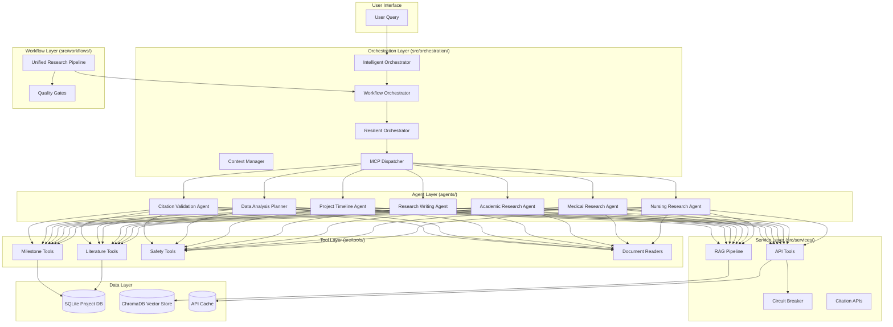

# Project Architecture: nurseRN (Nursing Research Project Assistant)

## 1. Overview
The `nurseRN` project is a sophisticated multi-agent AI system designed to assist nursing residents in their healthcare improvement projects. It leverages the Agno (formerly Phidata) framework to coordinate specialized agents for research, writing, planning, and analysis.

## 2. High-Level Architecture
The system follows a modular, layered architecture designed for resilience, scalability, and professional-grade research output.

### 2.1. Layered Structure
- **Agent Layer**: Specialized AI agents with domain expertise.
- **Orchestration Layer**: Coordination, planning, and resilient execution.
- **Workflow Layer**: Multi-phase research pipelines and quality control.
- **Service Layer**: Core infrastructure services (API management, RAG, validation).
- **Tool Layer**: Domain-specific tools for data retrieval and manipulation.
- **Data Layer**: Persistent storage for projects, conversations, and knowledge.

---

## 3. Component Details

### 3.1. Agent Layer (`agents/`)
Specialized agents designed for specific nursing research tasks:
- **Nursing Research Agent**: PICOT development, healthcare standards, and evidence-based practice.
- **Medical Research Agent**: Deep PubMed searches for peer-reviewed clinical studies.
- **Academic Research Agent**: ArXiv searches for theoretical and methodological research.
- **Research Writing Agent**: Academic writing, literature synthesis, and poster content.
- **Project Timeline Agent**: Milestone tracking and deadline management.
- **Data Analysis Planner**: Statistical test selection, sample size calculations, and data templates.
- **Citation Validation Agent**: Specialized in verifying PMIDs and checking for retractions.

### 3.2. Orchestration Layer (`src/orchestration/`)
The "brain" of the system that coordinates agent activities:
- **IntelligentOrchestrator**: Uses LLMs to decompose complex user goals into actionable agent tasks and synthesizes the final response.
- **WorkflowOrchestrator**: Handles the low-level execution of agent tasks, supporting both sequential and parallel execution.
- **ResilientOrchestrator**: Implements retry logic, exponential backoff, and fallback mechanisms to ensure reliability.
- **MCP (Model Context Protocol)**: A standardized messaging format for inter-component communication.
- **Context Management**: Manages conversation history, request metadata, and workflow state.

### 3.3. Workflow Layer (`src/workflows/`)
Structured processes for complex research tasks:
- **Unified Research Pipeline**: A 6-phase professional workflow:
  1. PICOT Generation
  2. Literature Search
  3. Citation Validation
  4. Evidence Synthesis
  5. Analysis Planning
  6. Timeline Setup
- **Quality Gates**: Automated checkpoints that validate outputs against professional standards (e.g., Johns Hopkins Evidence Levels).

### 3.4. Service Layer (`src/services/`)
Infrastructure services that support the entire system:
- **API Tools**: Safe wrappers for external APIs (PubMed, Exa, Tavily, etc.) with built-in circuit breakers and caching.
- **Circuit Breaker**: Prevents cascade failures by opening circuits to failing external services.
- **RAG Pipeline**: Retrieval-Augmented Generation using ChromaDB for grounding agent responses in local knowledge.
- **Citation APIs**: Specialized clients for PubMed E-Utils and other citation services.

### 3.5. Tool Layer (`src/tools/`)
Custom tools that extend agent capabilities:
- **LiteratureTools**: Interface for saving and retrieving research findings from the project database.
- **MilestoneTools**: Manages project deadlines and requirements.
- **SafetyTools**: Interfaces with OpenFDA for device recalls and drug adverse events.
- **DocumentReaderTools**: Specialized readers for PDF, PPTX, CSV, and web content.

### 3.6. Data Layer
- **Project Databases (SQLite)**: Each project has a dedicated database (`project.db`, `pipeline_results.db`) with tables for PICOT, literature, milestones, etc.
- **Vector Store (ChromaDB)**: Stores embeddings for RAG-based retrieval.
- **API Cache**: SQLite-based cache for external API responses (24h TTL).

---

## 4. Key Design Principles
- **Resilience First**: Circuit breakers, retries, and safe fallbacks are integrated at every level.
- **Strict Grounding**: All research claims must be backed by verified citations (PMIDs).
- **Project-Centric**: Data is organized around specific nursing projects.
- **Standardized Reasoning**: Agents follow a consistent "Think-Act-Observe" loop.
- **Quality Controlled**: Automated gates ensure academic and clinical rigor.

## 5. Technology Stack
- **Language**: Python 3.8+
- **Agent Framework**: Agno (Phidata)
- **LLMs**: OpenAI (GPT-4o, GPT-4o-mini)
- **Databases**: SQLite, ChromaDB
- **APIs**: PubMed, ClinicalTrials.gov, medRxiv, Semantic Scholar, CORE, DOAJ, SerpAPI, Exa, Tavily.
